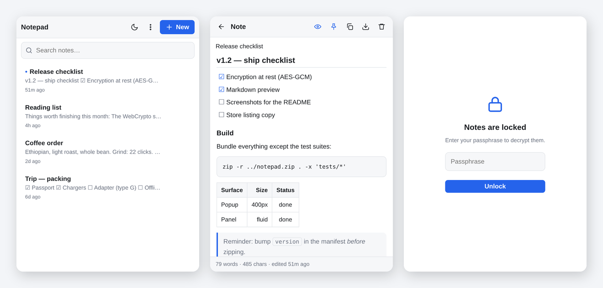
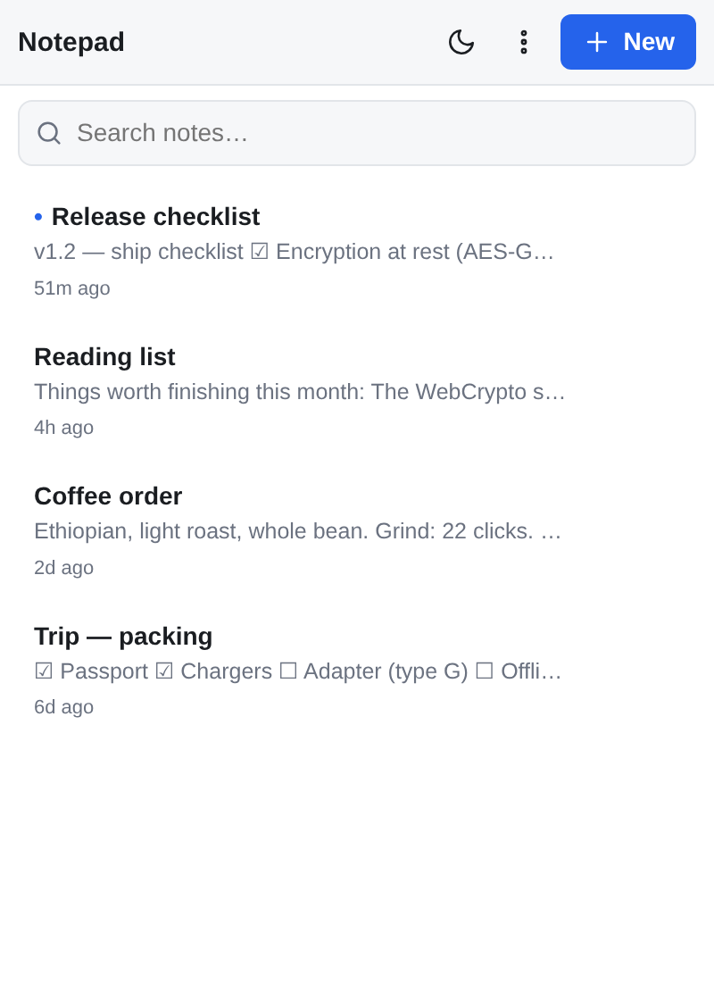
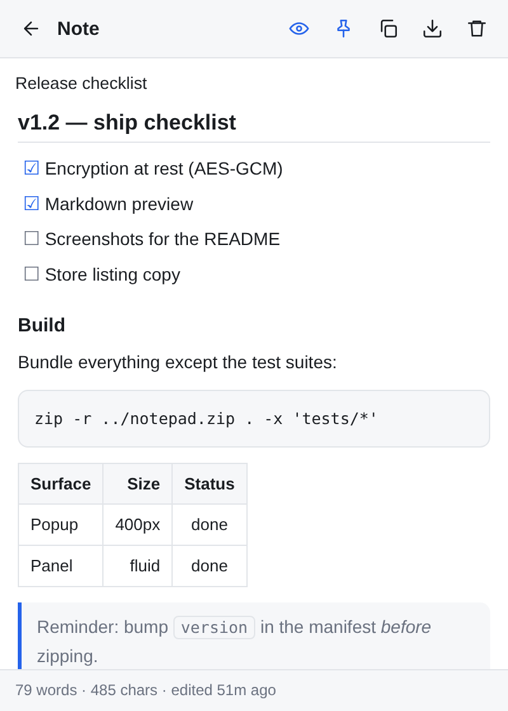
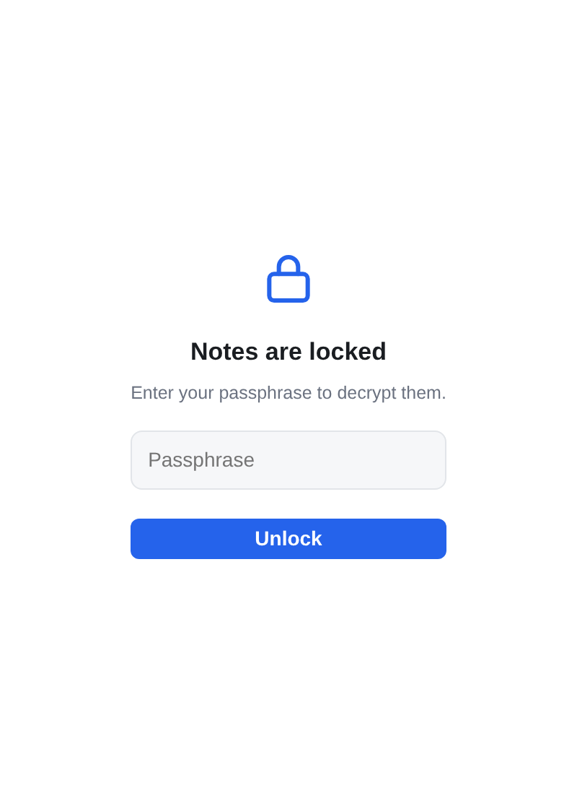
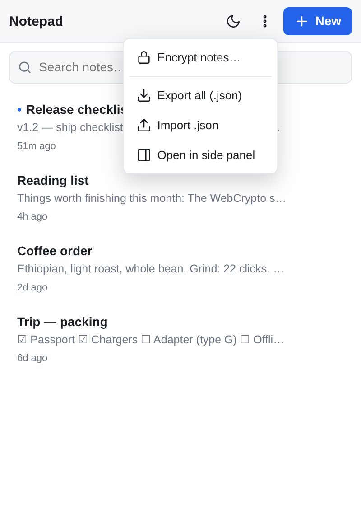
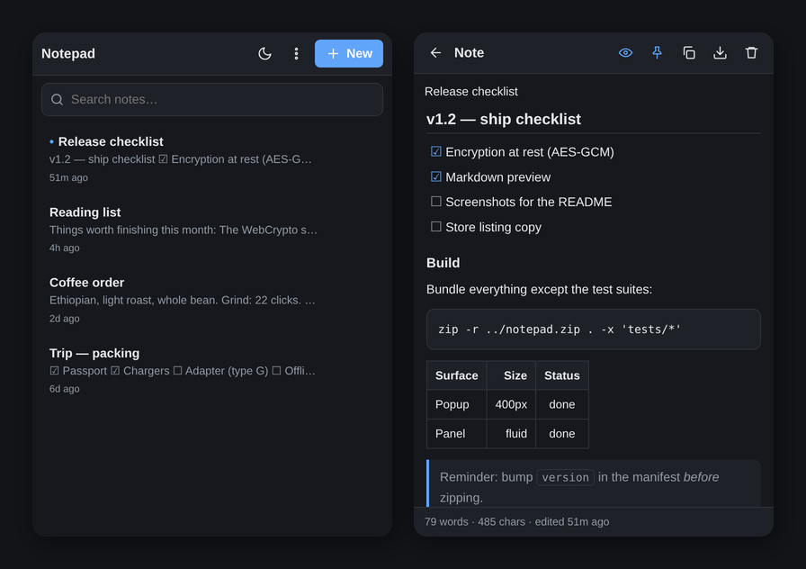

# Notepad — Chrome extension

A small, offline notepad that lives in the toolbar. No accounts, no network, no
content scripts — notes are stored in `chrome.storage.local` on your machine.
Optional AES-GCM encryption at rest. Markdown preview. No dependencies.



> **Status:** hobby project, not independently audited. The crypto uses standard
> WebCrypto primitives and is covered by tests, but it has had no third-party review.
> Treat it as a notepad, not as a password manager. Issues and review welcome.

## Screenshots

| | |
|---|---|
|  |  |
| Notes list — pinned first, search across titles and bodies | Markdown preview — `Ctrl+E` toggles |
|  |  |
| Locked: the key is gone from memory, only ciphertext is on disk | Encryption, export/import, and the side panel |

Dark mode follows the system and can be overridden:



## Install (unpacked)

1. Open `chrome://extensions`
2. Turn on **Developer mode** (top right)
3. **Load unpacked** → select the folder you cloned into
4. Pin "Notepad" to the toolbar

## Use

- Click the icon (or **Alt+N**) to open the popup
- **⋮ → Open in side panel** for a taller, always-visible notepad next to the page
- Notes autosave ~350 ms after you stop typing; the last-edited note reopens on launch

### Shortcuts

| Key | Action |
|---|---|
| `Alt+N` | Open Notepad |
| `Ctrl+N` | New note |
| `Ctrl+F` | Focus search |
| `Ctrl+S` | Force save now |
| `Ctrl+L` | Lock the vault (when encryption is on) |
| `Ctrl+E` | Toggle markdown preview |
| `Esc` | Back to the note list |
| `Tab` | Insert a tab in the note body |

### Features

- Multiple notes, pin to top, search across titles and bodies with match highlighting
- Light/dark theme (follows the system by default, toggle to override)
- Copy note, download a single note as `.txt`
- Export **all** notes to `.json` and import them back (import merges, never overwrites —
  colliding IDs are re-issued)
- Popup and side panel stay in sync live via `chrome.storage.onChanged`
- **Markdown preview** — see below
- **Optional encryption at rest** — see below

## Markdown

Notes are plain text on disk; the preview is a render of that text. Toggle it with the
eye icon in the editor header, or **Ctrl+E**. The setting is sticky.

Supported: headings, **bold**, *italic*, ~~strikethrough~~, `code`, fenced code blocks with
a language label, links and bare URLs, bullet and numbered lists with nesting, task lists
(`- [ ]` / `- [x]`), blockquotes, tables with alignment, and horizontal rules.

The renderer is ~190 lines in `markdown.js` with **no dependencies** — nothing is fetched
from a CDN, so there is no supply chain to trust.

**Why it is written the way it is:** turning note text into HTML is the textbook XSS sink.
So the text is HTML-escaped *before* any markup is built — tags can only come from the
parser, never from your note. Raw HTML in the source is deliberately not passed through.
Link schemes are allowlisted to `http`, `https` and `mailto`; anything else renders as
plain text. Then `renderInto()` runs the result through a DOM sanitizer that strips every
element outside a fixed allowlist and every attribute outside a per-tag allowlist, so even
a parser bug cannot yield a live event handler. That last layer is tested against real
Chromium, not a stub.

## Encryption

Off by default. Turn it on with **⋮ → Encrypt notes…**.

- Passphrase → **PBKDF2-HMAC-SHA256, 1,200,000 iterations**, random 16-byte salt per vault
  → **AES-GCM-256**. Fresh 12-byte IV on every write.
- The passphrase is never stored. The GCM auth tag *is* the passphrase check — a wrong
  passphrase fails to decrypt rather than being compared against anything.
- The derived key is cached in `chrome.storage.session` (memory only, wiped when Chrome
  exits) so you unlock once per browser session. **Auto-locks after 15 minutes idle**;
  `Ctrl+L` locks immediately.
- Writes are refused while locked, so a locked window can never overwrite your ciphertext.
- `theme` stays outside the ciphertext so the lock screen can paint correctly. Nothing else does.

### What this protects against, and what it does not

| Threat | Protected? |
|---|---|
| Someone reads your profile folder / a disk image / a backup | **Yes**, while locked |
| Another extension or a website reads your notes | **Yes** — Chrome isolates extension storage; this one has no host permissions anyway |
| Notes leaving your machine | **Yes** — there is no network code at all |
| Malware running as your user *while unlocked* | **No** — the key is in memory and readable |
| Someone at your unlocked screen, extension unlocked | **No** — lock it (`Ctrl+L`) |
| Forgotten passphrase | **No recovery. The notes are unrecoverable.** |

> **If you had notes before turning encryption on:** `chrome.storage.local` is LevelDB, and
> overwritten values can linger in old `.log`/`.ldb` files until compaction. Encrypting
> existing notes does not reliably scrub the earlier plaintext from disk. For anything
> genuinely sensitive, turn encryption on **first**, then write the notes.

PBKDF2 is used because it is the only KDF WebCrypto ships — Argon2id would be stronger
against GPU cracking but needs a WASM dependency. Pick a long passphrase.

## Tests

```
cd notepad-extension
node tests/vault.test.mjs      # crypto: round-trip, tamper detection, IV uniqueness, cache expiry
node tests/app.test.mjs        # storage layer: encrypt / lock / unlock, locked-write guard
node tests/markdown.test.mjs   # rendering + injection vectors + link scheme allowlist
sh   tests/run-dom-test.sh     # DOM sanitizer, in real headless Chromium
```

78 assertions. The Node suites run against the real `vault.js`, `markdown.js` and `app.js`
with `chrome.*` and the DOM stubbed; the DOM test uses actual Chromium because a stubbed
`querySelectorAll` cannot prove a sanitizer works.

## Files

| File | Role |
|---|---|
| `manifest.json` | MV3 manifest — `storage` + `sidePanel` permissions only |
| `popup.html` / `panel.html` | Same UI, two surfaces |
| `app.js` | All the logic (list, editor, autosave, import/export) |
| `app.css` | Theme tokens + layout |
| `vault.js` | WebCrypto vault — PBKDF2 derivation, AES-GCM, session key cache |
| `markdown.js` | Dependency-free Markdown renderer + DOM sanitizer |
| `background.js` | Service worker; side-panel behaviour on install |
| `tests/` | Node test suites (exclude from a store build) |

## Publishing to the Web Store

Zip the folder contents (not the folder itself), then upload at
`https://chrome.google.com/webstore/devconsole`. A $5 one-time developer fee applies.

```
cd notepad-extension && zip -r ../notepad-extension.zip . -x '*.git*' 'tests/*' 'README.md'
```
